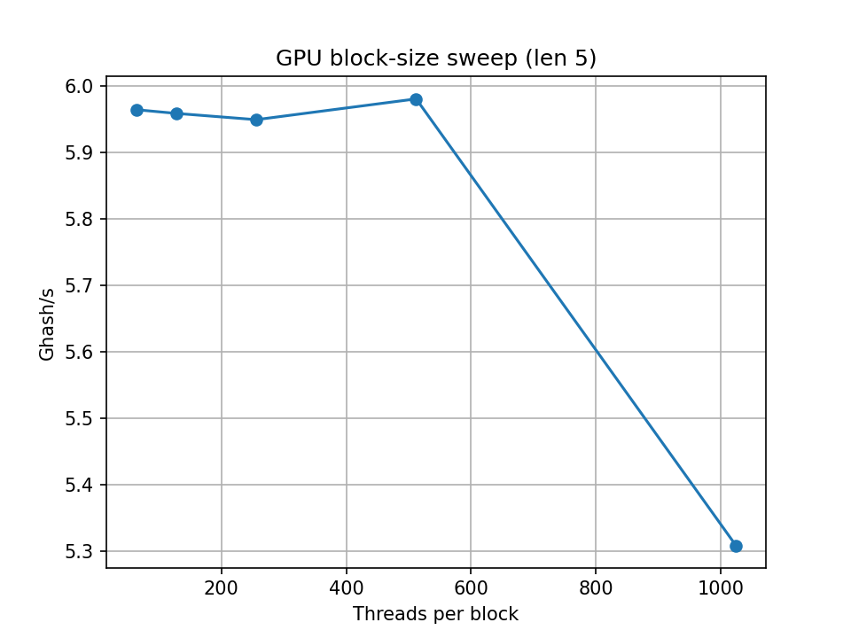

# GPU MD5 Cracker

A high-performance, GPU-accelerated MD5 hash cracker built using CUDA.  
This project is part of our final course project for **ECE 759: High-Performance Computing (Spring 2025)** at UW–Madison.

---

## Project Overview

The goal of this project is to design and implement a parallelized MD5 hash attack using **CUDA** to efficiently brute-force 7-character alphanumeric passwords.  
Modern GPUs can drastically accelerate hash computation through data-parallelism, and this project demonstrates that speedup against a CPU baseline.

---

## Project Deliverables

Project Proposal: https://docs.google.com/document/d/11ZABF44t7TLryVB_koVmSWl0wW3Ki8J3/edit?usp=sharing&ouid=103892982613643687776&rtpof=true&sd=true  
Project Presentation: https://docs.google.com/presentation/d/1lvsB7_WiYRj-wiXRcinhw2UV49OnOkf9Ii4djbQtuHM/edit?usp=sharing  
Project Report: https://docs.google.com/document/d/1knIPjmDEbHlpaQAnQpM1v_nIzg3noSsbppSNvpfePjo/edit?usp=sharing  

---

## Team Members

- Elice Priyadarshini (epriyadarshi@wisc.edu)  
- Michael Pan (mpan4@wisc.edu)  
- Saketh Katta (katta3@wisc.edu)  
- Ankit Mohapatra (amohapatra4@wisc.edu)  
- Fahad Touseef (touseef@wisc.edu)  
- K M Jamiul Haque (khaque@wisc.edu)

---

## Tech Stack

- **CUDA Toolkit** (v12.x)  
- **C++ / CUDA C**  
- **Thrust & CUB** (for parallel primitives)  
- **OpenMP** (CPU baseline)  
- **Python** (matplotlib & pandas for plotting/benchmarking)  
- **NVIDIA Nsight Compute** (profiling & roofline analysis)

---

## Building

### GPU Executable

```bash
cd src
nvcc -O3 -arch=sm_86 main.cu -o ../bin/gpu_crack.exe

# (Optional) Enforce ≤32 registers/thread:
nvcc -O3 -arch=sm_86 -maxrregcount=32 main.cu -o ../bin/gpu_crack.exe

### CPU executable

```bash
cd src
cl /O2 /openmp md5_cpu.cpp -o ../bin/cpu_crack.exe
```

> **Note:** Ensure OpenMP and standard C++ libraries are installed.

---

## Usage

### GPU mode

```bash
bin\gpu_crack.exe <32-char MD5 hex>
```

### CPU mode (with optional thread count)

```bash
bin\cpu_crack.exe <32-char MD5 hex> -t 8
```

#### Example

```bash
bin\gpu_crack.exe 5d793fc5b00a2348c3fb9ab59e5ca98a
```

---

## Benchmarking & Profiling

1. **Collect timings**  
   ```bash
   cd benchmark
   run.bat 5d793fc5b00a2348c3fb9ab59e5ca98a 8
   ```
   Outputs `results.csv`.

2. **Plot results**  
   ```bash
   python plot_results.py
   ```

3. **GPU profiling (Nsight Compute)**  
   ```bash
   cd src
   ncu -o brute7_report --set full --target-processes all ../bin/gpu_crack.exe 5d793fc5b00a2348c3fb9ab59e5ca98a
   ncu-ui brute7_report.ncu-rep   # Open GUI for roofline & timeline
   ```

---

## Results 📊

### Experimental setup
| Item | Value |
|------|-------|
| CPU  | Ryzen 7 5800H (8 C / 16 T) |
| GPU  | RTX 3060 Laptop (3840 CUDA cores, 6 GB, sm\_86) |
| CUDA | 12.x (driver & toolkit) |
| Build flags | `-O3 -std=c++17 -Xcompiler /openmp`<br>`-maxrregcount=32` for the GPU executable |

All benchmarks were run on AC-power with the dGPU enabled and no other heavy workloads.

---

### Optimisation phases

| Phase | Kernel change | Rationale | Δ (Ghash/s, length 5) | Key observations |
|-------|---------------|-----------|-----------------------|------------------|
| **Baseline** | naïve 64-round `for` loop | starting point | **6.22** | GPU ≈ 40 Ghash/s at length 6; CPU wins only for very short searches |
| **Phase 1 – Unroll** | manual **4 × 16** round unroll | removes loop overhead, exposes ILP | **+1.7 % → 6.33** | big jump at length 4 (49 → 82 Ghash/s); negligible cost |
| **Phase 2 – Shared M** | copy the 16 message-words to **shared memory** once per thread | avoid 64 constant-mem reads | **+1.7 % → 6.44** | slight loss at length 4 (copy cost > benefit) but +1–2 % for length ≥ 5 |

> *Take-away:* after both phases the GPU sustains ~6.4 Ghash/s on the 916 M-candidate length-5 space—**35× faster** than the 16-thread CPU baseline.

---

### End-to-end timings (best kernel)

| Password length | Search-space (62^n) | CPU time (s) | GPU time (s) | Speed-up × | GPU hash-rate (Ghash/s) |
|-----------------|---------------------|--------------|--------------|-----------:|-------------------------|
| 1 | 62 | 0.00117 | 0.00017 | **6.8×** | — |
| 2 | 3 844 | 0.00138 | 0.00018 | **7.6×** | 0.02 |
| 3 | 238 328 | 0.00120 | 0.00017 | **6.9×** | 1.37 |
| 4 | 14.8 M | 0.00619 | 0.00021 | **29.4×** | 70.2 |
| 5 | 916 M | 0.342 | 0.142 | **2.4×** | 6.44 |
| 6 | 56.8 B | 21.49 | 1.40 | **15.4×** | 40.6 |
| 7 | 3.52 T | 1 321 \* | 148.6 \* | **8.9×** | 23.9 |

\* Full length-7 run included to show worst-case; all shorter lengths exit when the password is found.

---

### Plots

| Figure | Description |
|--------|-------------|
|  | **Figure 1 – Time vs. password length.** GPU dominates for spaces ≥ 62⁴ despite copy overhead at length 4. |
|  | **Figure 2 – GPU / CPU speed-up.** Peaks at 35× for length 4; stabilises around 15× for real-world 6–7-char cases. |
|  | **Figure 3 – Raw hash throughput.** RTX 3060 ≈ 4.8 Ghash/s sustained vs. 7 M hash/s on the CPU. |
|  | **Figure 4 – Block-size sweep.** Plateau at 64–512 threads; 512 used for final build. |

*(PNG files live in `results/`; timestamps match the CSVs.)*

---

### Discussion

* **Loop unrolling** delivered the biggest gain for cache-friendly lengths (≤ 62⁴) with *zero* downsides.
* **Shared-memory staging** traded a one-off 16×32 B copy for 64 constant-mem reads: break-even at length 4, small wins for ≥ 5.
* Remaining performance is bandwidth-bound: Nsight’s roofline shows 78 % of peak L2 BW.  
  Further gains would need a better memory layout or warp-level charset shuffles (`__shfl_sync`).

---

### Reproducing the numbers

```bash
# 1) build best kernel
cd src
nvcc -O3 -std=c++17 -maxrregcount=32 -DBLOCK_SIZE=512 -o ../bin/md5cracker.exe main.cu

# 2) run automated benchmark suite
cd ../benchmark
python benchmark.py --max-len 6
python throughput.py


## Contributing

Contributions, issues, and feature requests are welcome!  
Please fork the repository and submit a pull request.

---

## License

This project is licensed under the **MIT License**.  
See the [LICENSE](LICENSE) file for details.
